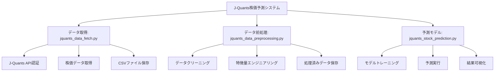

# J-Quants株価予測システム

J-Quants APIを使用して株価データを取得し、機械学習で株価予測を行うシステムです。

## 概要

このシステムは以下の3つの主要コンポーネントで構成されています：

1. **データ取得** (`jquants_data_fetch.py`) - J-Quants APIから株価データを取得
2. **データ前処理** (`jquants_data_preprocessing.py`) - データのクリーニングと特徴量エンジニアリング
3. **予測モデル** (`jquants_stock_prediction.py`) - 機械学習による株価予測

## システム構成



## セットアップ

### 1. 仮想環境の作成と依存関係のインストール

```bash
# 仮想環境を作成
python3 -m venv venv

# 仮想環境をアクティベート
source venv/bin/activate

# 依存関係をインストール
pip install -r requirements.txt
```

### 2. 環境変数の設定

`.env`ファイルを作成し、J-Quants APIの認証情報を設定してください：

```bash
# .env.sampleをコピーして.envファイルを作成
cp .env.sample .env

# .envファイルを編集して実際の認証情報を設定
# JQUANTS_EMAIL=your_email@example.com
# JQUANTS_PASSWORD=your_password
```

### 3. 設定ファイルの準備

`config.yaml`ファイルを作成し、必要な設定を行ってください。`config.yaml.sample`を参考にしてください。

```bash
cp config.yaml.sample config.yaml
```

## 設定のカスタマイズ

`config.yaml`を編集することで、システムの動作を簡単にカスタマイズできます：

### パラメータ調整例

```yaml
# 移動平均期間を変更
preprocessing:
  sma_windows:
    - 5
    - 10
    - 25
    - 50

# モデルパラメータを調整
prediction:
  random_forest:
    n_estimators: 200
    max_depth: 10
    random_state: 42
  test_size: 0.3
```

### 設定ファイルのテスト

```bash
# 設定ファイルの妥当性をチェック
python3 config_loader.py
```

## 使用方法

### 仮想環境のアクティベート
```bash
source venv/bin/activate
```

### データ取得
```bash
python3 jquants_data_fetch.py
```

### データ前処理
```bash
python3 jquants_data_preprocessing.py
```

### 株価予測
```bash
python3 jquants_stock_prediction.py
```

## 動作確認済み

✅ 依存関係のインストール  
✅ サンプルデータでの動作確認  
✅ データ前処理パイプライン  
✅ 機械学習モデルの訓練と予測  
✅ 結果の可視化  
✅ セキュリティ設定（認証情報の環境変数化）  
✅ 設定ファイル読み込み機能（YAMLベース）

## ファイル構成

```
├── jquants_data_fetch.py          # データ取得スクリプト
├── jquants_data_preprocessing.py  # データ前処理スクリプト
├── jquants_stock_prediction.py    # 株価予測スクリプト
├── config_loader.py               # 設定ファイル読み込みモジュール
├── jquants_flowchart.mmd          # システムフローチャート
├── requirements.txt               # Python依存関係
├── config.yaml.sample             # 設定ファイルサンプル
├── config.yaml                    # 設定ファイル（実際の設定）
├── .env.sample                     # 環境変数サンプル
└── README.md                       # このファイル
```

## 主要機能

### jquants_data_fetch.py
- J-Quants API認証
- 日次株価データの取得
- CSVファイルへのデータ保存

### jquants_data_preprocessing.py
- 必要なカラムの選択
- 日付の変換
- 移動平均などの特徴量追加
- 欠損値の処理
- 処理済みデータの保存

### jquants_stock_prediction.py
- ランダムフォレスト回帰モデルの構築
- モデルのトレーニングと評価
- 予測結果の可視化
- 特徴量重要度の分析

### config_loader.py
- YAML設定ファイルの読み込み
- 設定値の動的取得
- 設定妥当性チェック
- ログ設定の初期化

## データフロー

1. **データ取得**: J-Quants APIから株価データを取得
2. **データ前処理**: 特徴量エンジニアリングと欠損値処理
3. **モデルトレーニング**: 学習データでモデルをトレーニング
4. **予測実行**: テストデータで予測を実行
5. **評価と可視化**: 結果の評価とグラフ化

## 注意事項

- J-Quants APIの利用には登録が必要です
- APIの利用制限にご注意ください
- 認証情報は環境変数で管理し、リポジトリにコミットしないでください
- このシステムは投資アドバイスを提供するものではありません

## ライセンス

このプロジェクトはMITライセンスの下で公開されています。

## 貢献

バグ報告や機能要求は、GitHubのIssueでお知らせください。
