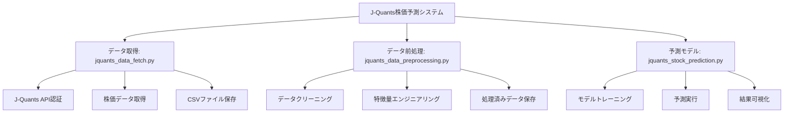

# J-Quants株価予測システム

J-Quants APIを使用して株価データを取得し、機械学習で株価予測を行うシステムです。

## 概要

このシステムは以下の3つの主要コンポーネントで構成されています：

1. **データ取得** (`jquants_data_fetch.py`) - J-Quants APIから株価データを取得
2. **データ前処理** (`jquants_data_preprocessing.py`) - データのクリーニングと特徴量エンジニアリング
3. **予測モデル** (`jquants_stock_prediction.py`) - 機械学習による株価予測

## システム構成



## セットアップ

### 1. 依存関係のインストール

```bash
pip install -r requirements.txt
```

### 2. 環境変数の設定

`.env`ファイルを作成し、J-Quants APIの認証情報を設定してください：

```
JQUANTS_EMAIL=your_email@example.com
JQUANTS_PASSWORD=your_password
```

### 3. 設定ファイルの準備

`config.yaml`ファイルを作成し、必要な設定を行ってください。`config.yaml.sample`を参考にしてください。

## 使用方法

### データ取得
```bash
python jquants_data_fetch.py
```

### データ前処理
```bash
python jquants_data_preprocessing.py
```

### 株価予測
```bash
python jquants_stock_prediction.py
```

## ファイル構成

```
├── jquants_data_fetch.py          # データ取得スクリプト
├── jquants_data_preprocessing.py  # データ前処理スクリプト
├── jquants_stock_prediction.py    # 株価予測スクリプト
├── jquants_flowchart.mmd          # システムフローチャート
├── requirements.txt               # Python依存関係
├── config.yaml.sample             # 設定ファイルサンプル
├── .env.sample                     # 環境変数サンプル
└── README.md                       # このファイル
```

## 主要機能

### jquants_data_fetch.py
- J-Quants API認証
- 日次株価データの取得
- CSVファイルへのデータ保存

### jquants_data_preprocessing.py
- 必要なカラムの選択
- 日付の変換
- 移動平均などの特徴量追加
- 欠損値の処理
- 処理済みデータの保存

### jquants_stock_prediction.py
- ランダムフォレスト回帰モデルの構築
- モデルのトレーニングと評価
- 予測結果の可視化

## データフロー

1. **データ取得**: J-Quants APIから株価データを取得
2. **データ前処理**: 特徴量エンジニアリングと欠損値処理
3. **モデルトレーニング**: 学習データでモデルをトレーニング
4. **予測実行**: テストデータで予測を実行
5. **評価と可視化**: 結果の評価とグラフ化

## 注意事項

- J-Quants APIの利用には登録が必要です
- APIの利用制限にご注意ください
- 認証情報は環境変数で管理し、リポジトリにコミットしないでください
- このシステムは投資アドバイスを提供するものではありません

## ライセンス

このプロジェクトはMITライセンスの下で公開されています。

## 貢献

バグ報告や機能要求は、GitHubのIssueでお知らせください。
