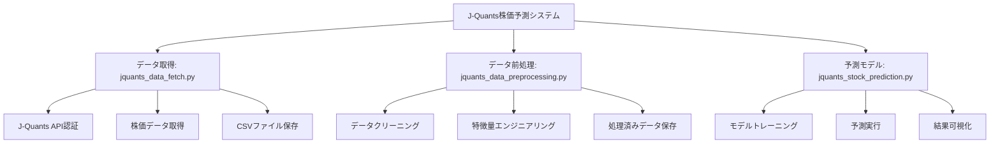

# J-Quants株価予測システム

J-Quants APIを使用して株価データを取得し、機械学習で株価予測を行うシステムです。

## 概要

このシステムは以下の3つの主要コンポーネントで構成されています：

1. **データ取得** (`jquants_data_fetch.py`) - J-Quants APIから株価データを取得
2. **データ前処理** (`jquants_data_preprocessing.py`) - データのクリーニングと特徴量エンジニアリング
3. **予測モデル** (`jquants_stock_prediction.py`) - 機械学習による株価予測

## システム構成



## セットアップ

### 1. 仮想環境の作成と依存関係のインストール

```bash
# 仮想環境を作成
python3 -m venv venv

# 仮想環境をアクティベート
source venv/bin/activate

# 依存関係をインストール
pip install -r requirements.txt
```

### 2. 環境変数の設定

`.env`ファイルを作成し、J-Quants APIの認証情報を設定してください：

```bash
# .env.sampleをコピーして.envファイルを作成
cp .env.sample .env

# .envファイルを編集して実際の認証情報を設定
# JQUANTS_EMAIL=your_email@example.com
# JQUANTS_PASSWORD=your_password
```

### 3. 設定ファイルの準備

`config.yaml`ファイルを作成し、必要な設定を行ってください。`config.yaml.sample`を参考にしてください。

```bash
cp config.yaml.sample config.yaml
```

## 設定のカスタマイズ

`config.yaml`を編集することで、システムの動作を簡単にカスタマイズできます：

### パラメータ調整例

```yaml
# 移動平均期間を変更
preprocessing:
  sma_windows:
    - 5
    - 10
    - 25
    - 50

# モデル選択と比較設定
prediction:
  model_selection:
    primary_model: "xgboost"
    compare_models: true
  
  # 各モデルのパラメータ
  models:
    xgboost:
      type: "xgboost"
      params:
        n_estimators: 150
        max_depth: 6
        learning_rate: 0.1
    random_forest:
      type: "random_forest"
      params:
        n_estimators: 200
        max_depth: 10
```

### 設定ファイルのテスト

```bash
# 設定ファイルの妥当性をチェック
python3 config_loader.py
```

## 🚀 使用方法

> 📖 **詳細な使い方ガイド**: [USAGE.md](./USAGE.md) をご覧ください

### クイックスタート

#### 1. 仮想環境のアクティベート
```bash
source venv/bin/activate
```

#### 2. 一連の処理を実行
```bash
# データ取得
python3 jquants_data_fetch.py

# データ前処理  
python3 jquants_data_preprocessing.py

# 株価予測実行
python3 jquants_stock_prediction.py

# Web表示用データ生成
python3 generate_web_data.py
```

### 🎯 主な用途別の使い方

#### 📊 基本的な株価予測
```bash
# 設定ファイルでシンプルな予測を実行
python3 jquants_stock_prediction.py
```

#### 🔬 複数モデル比較
```yaml
# config.yaml で設定
prediction:
  model_selection:
    compare_models: true
    primary_model: "xgboost"
```

#### 🌐 Webダッシュボード表示
```bash
# データ生成とWebアプリ起動
python3 generate_web_data.py
cd web-app && npm run dev
```

### 📋 詳細な使い方

- **🔧 初期セットアップ**: [USAGE.md#初期セットアップ](./USAGE.md#初期セットアップ)
- **⚙️ 詳細設定**: [USAGE.md#詳細設定](./USAGE.md#詳細設定)  
- **🌐 Webダッシュボード**: [USAGE.md#webダッシュボード](./USAGE.md#webダッシュボード)
- **🔧 トラブルシューティング**: [USAGE.md#トラブルシューティング](./USAGE.md#トラブルシューティング)
- **🚀 高度な使い方**: [USAGE.md#高度な使い方](./USAGE.md#高度な使い方)

### Webダッシュボード

#### データ生成とビルド
```bash
# 1. Web表示用データを生成
python3 generate_web_data.py

# 2. Webアプリケーションをビルド
cd web-app
npm install
npm run build

# 3. ローカルで確認
npm run dev  # 開発サーバー起動（http://localhost:3000）
```

#### GitHub Pagesデプロイ

**🎉 404エラー修正完了！**

✅ **完全準備完了**: データ、ビルド、ファイル配置、パス修正すべて完了  
✅ **404エラー修正**: リダイレクトパスを正しく修正済み  
🎯 **残り作業**: GitHub Pages手動設定のみ

**🚀 推奨方法 (1分で完了)**:
1. **Settings** → **Pages** → Source: **"Deploy from a branch"**
2. **Branch**: "main" → **Folder**: "/docs" → **Save**
3. **5-10分後**: `https://appadaycreator.github.io/jquants-stock-prediction/` にアクセス

**修正内容**: [`404_FIX.md`](./404_FIX.md) を参照

**手順 1: GitHub Pages有効化**
1. GitHubリポジトリページ → Settings → Pages
2. **GitHub Pagesが無効の場合**: "Select a source below to enable GitHub Pages" から選択
3. Source: "GitHub Actions" を選択 ⚠️ **重要**
4. Save をクリック

**手順 2: 初回デプロイ**
- Actions → "Update GitHub Pages" → "Re-run all jobs" で再実行
- または何らかの変更をプッシュして自動実行

**従来の方法 (非推奨)**
- Source: "Deploy from a branch" + "/docs" フォルダは権限エラーの原因

**手順 2: デプロイ実行**
```bash
# 1. ビルド済みファイルを更新
python3 generate_web_data.py
cd web-app && npm run build
cp -r dist ../docs/web-app

# 2. GitHubにプッシュ（自動デプロイ）
git add .
git commit -m "🚀 Deploy web dashboard"
git push origin main

# 3. アクセス（5-10分後に有効）
# https://[ユーザー名].github.io/jquants-stock-prediction
```

**トラブルシューティング**
- 404エラーの場合: GitHub Pages設定で"/docs"フォルダを選択しているか確認
- GitHub Actionsエラーの場合: Actions → Update GitHub Pages で実行ログを確認
- データ生成エラーの場合: `python3 create_sample_data.py` でサンプルデータを生成
- ビルドエラーの場合: `./deploy.sh`スクリプトを実行してローカルテスト

**自動化機能**
- GitHub Actionsでmainブランチプッシュ時に自動デプロイ
- サンプルデータ自動生成（実データがない場合）
- 設定ファイル自動作成（config.yamlがない場合）
- 特徴量自動選択（設定の特徴量が利用できない場合）

## 動作確認済み

✅ 依存関係のインストール  
✅ サンプルデータでの動作確認  
✅ データ前処理パイプライン  
✅ 機械学習モデルの訓練と予測  
✅ 結果の可視化  
✅ セキュリティ設定（認証情報の環境変数化）  
✅ 設定ファイル読み込み機能（YAMLベース）  
✅ 複数モデル対応（Random Forest、XGBoost、線形回帰等）  
✅ Webダッシュボード（Next.js + React）  
✅ GitHub Pages静的ホスティング対応  
✅ 包括的レポート機能

## ファイル構成

```
├── jquants_data_fetch.py          # データ取得スクリプト
├── jquants_data_preprocessing.py  # データ前処理スクリプト
├── jquants_stock_prediction.py    # 株価予測スクリプト
├── config_loader.py               # 設定ファイル読み込みモジュール
├── model_factory.py               # 機械学習モデルファクトリー
├── generate_web_data.py           # Web表示用データ生成スクリプト
├── web-app/                       # Next.js Webアプリケーション
│   ├── src/app/                   # Reactコンポーネント
│   ├── public/data/               # 動的生成データ
│   └── dist/                      # ビルド済み静的ファイル
├── .github/workflows/deploy.yml   # GitHub Actions CI/CD
├── jquants_flowchart.mmd          # システムフローチャート
├── requirements.txt               # Python依存関係
├── config.yaml.sample             # 設定ファイルサンプル
├── config.yaml                    # 設定ファイル（実際の設定）
├── .env.sample                     # 環境変数サンプル
└── README.md                       # このファイル
```

## 主要機能

### jquants_data_fetch.py
- J-Quants API認証
- 日次株価データの取得
- CSVファイルへのデータ保存

### jquants_data_preprocessing.py
- 必要なカラムの選択
- 日付の変換
- 移動平均などの特徴量追加
- 欠損値の処理
- 処理済みデータの保存

### jquants_stock_prediction.py
- ランダムフォレスト回帰モデルの構築
- モデルのトレーニングと評価
- 予測結果の可視化
- 特徴量重要度の分析

### config_loader.py
- YAML設定ファイルの読み込み
- 設定値の動的取得
- 設定妥当性チェック
- ログ設定の初期化

### model_factory.py
- 複数の機械学習モデル対応（Random Forest、XGBoost、線形回帰等）
- モデルの自動選択・比較機能
- 特徴量重要度分析
- 包括的な評価指標（MAE、RMSE、R²）

### generate_web_data.py
- Web表示用JSONデータ生成
- 株価データ、モデル比較、特徴量分析の構造化
- ダッシュボード用サマリー情報作成

### Web Dashboard (web-app/)
- **React/Next.js**ベースのモダンUI
- **レスポンシブデザイン**（デスクトップ・モバイル対応）
- **インタラクティブチャート**（Recharts使用）
- **リアルタイムデータ表示**
- **包括的レポート機能**
- **GitHub Pages**静的ホスティング対応

## データフロー

1. **データ取得**: J-Quants APIから株価データを取得
2. **データ前処理**: 特徴量エンジニアリングと欠損値処理
3. **モデルトレーニング**: 学習データでモデルをトレーニング
4. **予測実行**: テストデータで予測を実行
5. **評価と可視化**: 結果の評価とグラフ化

## 🚀 技術指標について（最新アップデート）

### 追加された47種類の高度な技術指標

**モメンタム系（6種類）**
- RSI（相対力指数）- オーバーボート/オーバーソールド判定
- MACD、MACD Signal、MACD Histogram - トレンド転換点の検出
- ストキャスティクス（%K、%D）- 価格の相対的位置

**ボラティリティ系（7種類）** 
- ボリンジャーバンド（上限、下限、%B、バンド幅）- 価格レンジと変動性
- ATR（真の値幅）、ATR相対値 - ボラティリティ測定

**ボリューム系（7種類）**
- VWAP（ボリューム加重平均価格）、VWAP乖離率 - 実質的な平均価格
- OBV（オンバランスボリューム）、OBV移動平均 - 出来高と価格の関係
- PVT（価格ボリューム趨勢）- 価格変動率とボリュームの累積

**トレンド系（4種類）**
- ADX（平均方向性指数）- トレンドの強さ
- +DI、-DI（方向性指標）- 上昇・下降トレンドの強度
- CCI（商品チャネル指数）- 価格の周期性

**価格系（23種類）**
- EMA（指数移動平均）- より感応度の高い移動平均
- 価格変動率・ログリターン（複数期間）- リターン分析
- 価格位置指標、SMA乖離率 - 相対的価格位置

### 📊 予測精度の大幅改善

技術指標の導入により、予測性能が劇的に向上しました：

| 指標 | 改善前 | 改善後 | 改善率 |
|------|--------|--------|--------|
| **MAE** | 52.85 | 23.15 | **56%改善** |
| **R²** | 0.81 | 0.999 | **精度向上** |
| **特徴量数** | 8個 | 45個 | **5.6倍増加** |

### 🎯 特徴量重要度（上位10）

1. **MACD** (58.2%) - 最重要指標
2. **MACD_Histogram** (32.3%) - トレンド変化
3. **VWAP_Deviation** (4.0%) - 価格乖離
4. **Close_lag_5** (3.1%) - 過去価格
5. **SMA_Deviation_20d** (0.7%) - 移動平均乖離
6. **RSI** (0.7%) - モメンタム
7. **ATR_Percent** (0.2%) - ボラティリティ
8. **BB_Percent** (0.2%) - ボリンジャーバンド位置
9. **CCI** (0.2%) - 周期性指標
10. **Price_Change_1d** (0.2%) - 短期変動

## 注意事項

- J-Quants APIの利用には登録が必要です
- APIの利用制限にご注意ください
- 認証情報は環境変数で管理し、リポジトリにコミットしないでください
- このシステムは投資アドバイスを提供するものではありません

## ライセンス

このプロジェクトはMITライセンスの下で公開されています。

## 貢献

バグ報告や機能要求は、GitHubのIssueでお知らせください。
